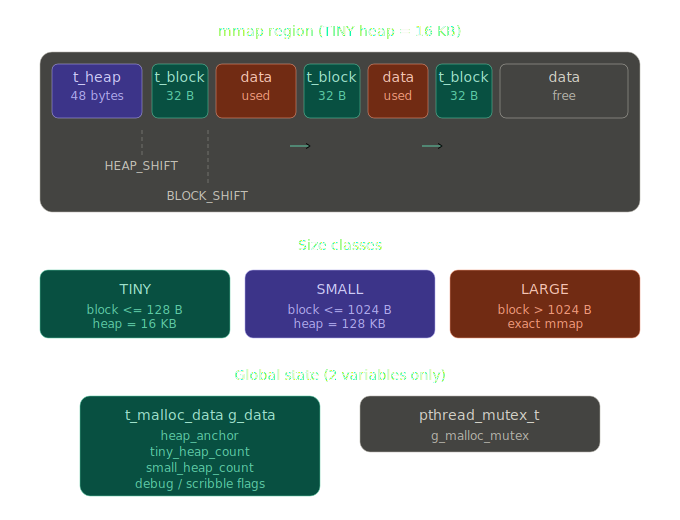
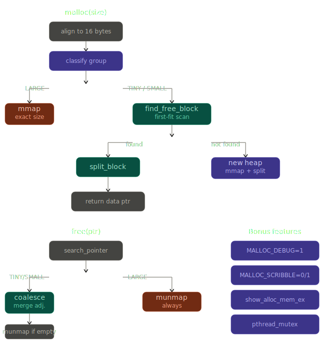

# ft_malloc

A custom implementation of `malloc`, `free`, and `realloc` in C, built as a shared library. This project reimplements the standard memory allocator using `mmap`/`munmap` with a three-tier allocation strategy optimized for different block sizes.

## Memory Layout



Each `mmap` region begins with a `t_heap` metadata header (48 bytes), followed by a doubly-linked list of `t_block` nodes (32 bytes each) and their associated data payloads. The `HEAP_SHIFT` and `BLOCK_SHIFT` macros skip past these headers to return a clean data pointer to the caller.

## Allocation Flow



### malloc

1. Align the requested size to 16 bytes.
2. Classify the request into a size group (TINY / SMALL / LARGE).
3. **LARGE**: `mmap` an exact-fit region and return the data pointer.
4. **TINY / SMALL**: scan existing heaps with `find_free_block` (first-fit).
   - Block found → `split_block` + mark used → return pointer.
   - No block found → allocate a new heap with `mmap`, split the first block.

### free

- Locate the owning heap and block via `search_pointer`.
- **TINY / SMALL**: mark free, `coalesce_block` (merge adjacent free blocks), `munmap` the entire heap if it becomes empty.
- **LARGE**: `munmap` immediately (scribble `0xdd` over data first if `MALLOC_SCRIBBLE=1`).

### realloc

- `ptr == NULL` → behaves as `malloc(size)`.
- `size == 0` → behaves as `free(ptr)`.
- `original_size >= size` → shrink in place via `split_block`.
- Otherwise → `malloc` new region, `memmove` data, `free` old region.

---

## Size Classes

| Class | Block size | Heap size |
|-------|-----------|-----------|
| TINY  | ≤ 128 B   | 16 KB (4 × page) |
| SMALL | ≤ 1024 B  | 128 KB (32 × page) |
| LARGE | > 1024 B  | exact size |

Sizes are derived at runtime using `getpagesize()`:

```c
#define TINY_HEAP_ALLOCATION_SIZE  (4  * getpagesize())
#define TINY_BLOCK_SIZE            (TINY_HEAP_ALLOCATION_SIZE  / 128)
#define SMALL_HEAP_ALLOCATION_SIZE (32 * getpagesize())
#define SMALL_BLOCK_SIZE           (SMALL_HEAP_ALLOCATION_SIZE / 128)
```

---

## Project Structure

```
malloc/
├── inc/
│   ├── malloc.h        # Main header (global vars, includes)
│   ├── struct.h        # t_heap, t_block, t_malloc_data, t_heap_group
│   ├── define.h        # HEAP_SHIFT, BLOCK_SHIFT, size macros
│   └── functions.h     # All function prototypes
├── src/
│   ├── malloc.c        # malloc() + start_malloc()
│   ├── free.c          # free()  + start_free()
│   ├── realloc.c       # realloc() + start_realloc()
│   ├── block/
│   │   ├── block.c     # find_free_block, split_block, coalesce_block
│   │   └── init_block.c
│   ├── heap/
│   │   ├── heap.c      # create_new_heap, remove_heap, append_empty_block
│   │   ├── get_heap.c  # get_heap_of_block_size, get_heap_group_from_block_size
│   │   └── helper_heap.c
│   └── tools/
│       ├── show_alloc_mem.c  # show_alloc_mem, show_alloc_mem_ex
│       ├── tools.c           # ft_memset, ft_memmove, ft_putstr_fd, …
│       └── pointer.c         # search_pointer, print_memory_address_portable
└── main.c              # Test harness
```

---

## Build

```bash
make          # builds libft_malloc_<arch>_<OS>.so + symlink libft_malloc.so
make clean    # remove object files
make fclean   # remove objects + library
make re       # fclean + all
```

The library name embeds the host type automatically:

```makefile
HOSTTYPE := $(shell uname -m)_$(shell uname -s)
NAME = libft_malloc_$(HOSTTYPE).so
```

### Run the test binary

```bash
make run
```

### Debug modes

```bash
make debug_mode     # MALLOC_DEBUG=1 ./test_malloc
make scribble_mode  # MALLOC_SCRIBBLE=1 ./test_malloc
make valgrind       # valgrind with soname synonym
```

---

## Environment Variables

| Variable          | Effect |
|-------------------|--------|
| `MALLOC_DEBUG=1`  | Print each `malloc`, `free`, `realloc` call with address and size |
| `MALLOC_SCRIBBLE=1` | Fill allocated memory with `0xaa`; fill freed LARGE blocks with `0xdd` |

---

## Diagnostics

```c
void show_alloc_mem(void);     // List all live allocations with addresses and sizes
void show_alloc_mem_ex(void);  // Same, plus a hex dump of each block's content
```

Example output:

```
===== Show Allocated Memory =====
TINY : 0x7f3a40000000
0x7f3a40000070 - 0x7f3a40000080 : 16 bytes
Total : 16 bytes
=================================
```

---

## Thread Safety

All public entry points (`malloc`, `free`, `realloc`, `show_alloc_mem`) acquire `g_malloc_mutex` (a `pthread_mutex_t`) before touching shared state and release it on exit, making the allocator safe for multithreaded programs.

---

## Global State

```c
t_malloc_data   g_data;          // heap_anchor, heap counts, debug/scribble flags
pthread_mutex_t g_malloc_mutex;  // protects all allocator state
```

---

## Author

donghank — 42 School project
